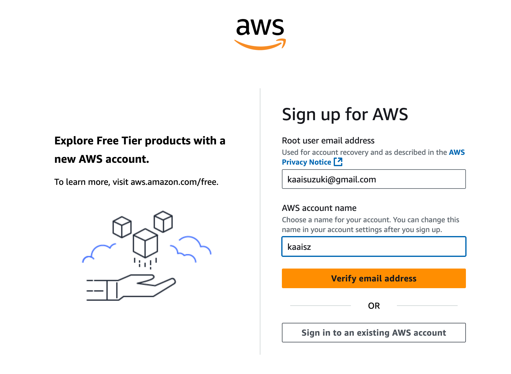
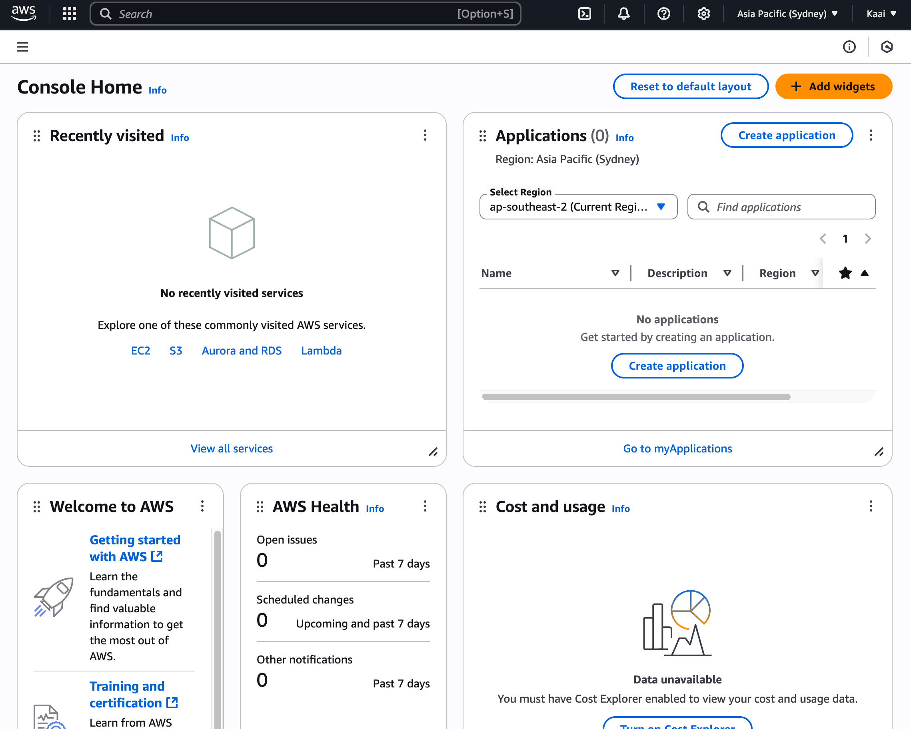

# 授業ノート：自律的情報技術学習演習

## Amazon EC2のセットアップ

> ブレイクアウトルームで4-5人の部屋に分かれて作成


### Tip: GCPを選択した場合

AWSではなくGCPを選択した場合、GCPは基本的にGメールなどのGoogleアカウントがあればコンソールに入ることは可能（カードの登録などは必要になります）
「ようこそ」のコンソール画面が表示されれば問題ない

### 1. ユーザー登録

1. Googleからリンクにアクセス：[Amazon AWS無料利用枠](https://aws.amazon.com/jp/free/?all-free-tier.sort-by=item.additionalFields.SortRank&all-free-tier.sort-order=asc&awsf.Free%20Tier%20Types=*all&awsf.Free%20Tier%20Categories=*all) または [Amazon AWS EC2無料トライアル](https://aws.amazon.com/jp/ec2/)
2. 「無料でAWSを開始」を押下
    1. ログイン済みの場合はコンソール画面に誘導されるので、6へ
    2. 未ログインの場合は3へ
3. メールアドレスの登録
    
    
    
4. 認証を求められるので、画面に表示される文字のタイピングを行い、SMSを通して認証
5. 住所、請求情報を求められるので、それぞれ登録して完了
6. 無事に登録が済むとコンソール画面に移動
    
    
    

#### ここまでのトラブルシューティング

- **Q:**
登録地は日本なのに入力がアメリカから切り替えできない
- **A:**
    
    背景
    
    - 同時刻に多数のユーザー → AWS地域判定API負荷 →
    処理遅延 → デフォルト値（US）返却 →
    全員にアメリカが表示　という感じで起こり得るらしい (via Claude Sonnet)
    
    対応策
    
    - シークレットウインドウで新しいメールアドレスを試してみる
        - シークレットウィンドウのショートカット
        Mac: Command + Shift + N
        Win: Ctrl + Shift + N
    - ①Chromeなら「シークレットウィンドウ」でアクセスしてみる
    ②SafariやEdgeなど、別のブラウザで試す - MacだとSafariが推奨されることがある

### 2. EC2のセットアップ


> EC2とは簡単に言うと：仮想のコンピュータを1分単位で借りれるサービス

1. Recently visited の画面にあるEC2をクリック
2. インスタンスを起動を押す
3. インスタンス名を入力 (任意の値)
4. Amazon Linux, インスタンスタイプ：t2microを選択
    - Amazon Linux + t2microが最も安価かつ失敗が少ない
    - 無料枠外でメモリの容量も自分の用途に合わせて選択可能
5. 新しいキーペアの作成でキーペアを作成
    - 自分でクラウドサービスを作成するにあたっては、サーバーのインスタンス = 仮想サーバーの数(要素)の作成 が必要
    - 拡張子は.pem で、SSH接続のものでOK
6. SSHに加えて、HTTPトラフィックを許可する
    - 0.0.0.0/0 と指定がある場合、世界のどこからでも作成可能
    
7. ストレージは30gbまで無料、8GB以上を推奨
8. Launch Instanceを押すと、インスタンスが生成される。
完了するとこのパネルが表示 ↓

9. 上記画像グレーの塗りつぶし部分がリンクになっているので、クリックして遷移
10.  遷移先のパブリックIPv4アドレスをコピー
    
#### 💡 ポイント：ストレージ容量の選び方について

##### 容量の継ぎ足しは可能だが、後から減らすことはできない

○ 8GBからスタートして、16GBに継ぎ足しは可能
× 16GBからスタートして、8GBへの減量は不可能

→ 少なく初めて、足りなくなったら継ぎ足す方が安価かつ安全

**参考リンク**
- [AWS SAA資格取得〜EBSとEFS編〜](https://qiita.com/Shoma-Kato/items/78878d88b74b17bd573d)
- [【2025年版】EBSのルートボリュームを縮小する方法](https://zenn.dev/kkageyama/articles/514968f2bbbb88)


### 3. ターミナル操作

1. ssh接続する / 解除する

```
ssh -i your/path/keypair.pem ec2-user@YOUR_IP_ADDRESS
```

2. そのまま接続を試みると、このような画面が表示

```
The authenticity of host 'YOUR_IP_ADDRESS (YOUR_IP_ADDRESS)' can't be established.
ED00000 key fingerprint is SHA256:****************.
This key is not known by any other names.
Are you sure you want to continue connecting (yes/no/[fingerprint])?
```

3. yesとタイプすると、以下のようにパーミッション権限を求められる

```
Warning: Permanently added 'YOUR_IP_ADDRESS' (ED00000) to the list of known hosts.
@@@@@@@@@@@@@@@@@@@@@@@@@@@@@@@@@@@@@@@@@@@@@@@@@@@@@@@@@@@
@         WARNING: UNPROTECTED PRIVATE KEY FILE!          @
@@@@@@@@@@@@@@@@@@@@@@@@@@@@@@@@@@@@@@@@@@@@@@@@@@@@@@@@@@@
Permissions 0644 for 'your/path/keypair.pem ec2-user@YOUR_IP_ADDRESS' are too open.
It is required that your private key files are NOT accessible by others.
This private key will be ignored.
Load key "your/path/keypair.pem ec2-user@YOUR_IP_ADDRESS": bad permissions
ec2-user@YOUR_IP_ADDRESS: Permission denied (publickey,gssapi-keyex,gssapi-with-mic).
```

1. そのため、以下のコマンドでパーミッション権限を変更

```
chmod 600 your/path/keypair.pem ec2-user@YOUR_IP_ADDRESS
```

1. もう一度1. のコマンドを実行。
以下のような結果が返ってくれば成功

```
   ,     #_
   ~\_  ####_        Amazon Linux 2023
  ~~  \_#####\
  ~~     \###|
  ~~       \#/ ___   https://aws.amazon.com/linux/amazon-linux-2023
   ~~       V~' '->
    ~~~         /
      ~~._.   _/
         _/ _/
       _/m/'
```


## Reference

### 授業内容

- タイムテーブル概略
  [https://yamakk.github.io/mau-diy/](https://yamakk.github.io/mau-diy/)

### AWS EC2関連

- Amazon EC2 公式document
  [https://docs.aws.amazon.com/ja_jp/AWSEC2/latest/UserGuide/EC2_GetStarted.html](https://docs.aws.amazon.com/ja_jp/AWSEC2/latest/UserGuide/EC2_GetStarted.html)
- もうちょっとわかりやすいスタートアップドキュメント
  [https://aws.amazon.com/jp/ec2/getting-started/](https://aws.amazon.com/jp/ec2/getting-started/)
- Amazon EC2インスタンス作成の手順 #AWS | Qiita 
  [https://qiita.com/hiro_10/items/3ee98a7842c3c74e0d29](https://qiita.com/hiro_10/items/3ee98a7842c3c74e0d29)
