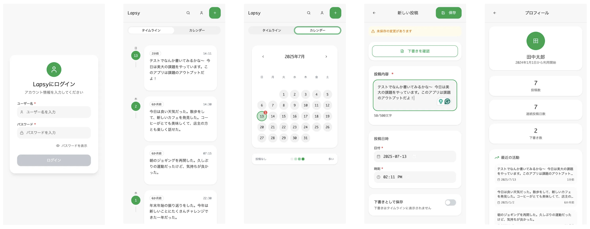

<link href="/assets/css/style.css" rel="stylesheet" />

[←TOPへ戻る](document.html)

# 自律的情報技術学習演習：作業の記録 Day-2〜中間課題

DS233292 鈴木可愛

## これは何

ムサビ通信「自律的情報技術学習演習」の2日目の授業の記録です
主に初日の課題を活かした発展課題のためのセットアップから行っていきます
※これ以降中間課題までかなり時間が限られていたので一部ドキュメント内容を割愛したり後ほど更新予定

<aside>

#### 🔖 目次

- [用意するもの](#anchor1)
    - [デザイン周り](#anchor1-1)
    - [開発周り](#anchor1-2)
- [ちょっと学習：EC2について改めて整理](#anchor2)
  - [EC2とはなんなのか](#anchor2-1)
  - [EC2との競合](#anchor2-2)
  - [EC2が選ばれる理由](#anchor2-3)
    - [🔍 EC2 が選ばれやすい決定打](#anchor2-3-1)
  - [そもそもクラウドコンピューティングとはなんなのか](#anchor2-4)
    - [自前のパソコン／サーバーと何が違う？](#anchor2-4-1)
    - [クラウドには3つのサービスレイヤーがある。EC2はIaaS](#anchor2-4-2)
    - [クラウドコンピューティングが選ばれる理由](#anchor2-4-3)
    - [注意点](#anchor2-4-4)
  - [AWSのRoot UserとIAM Userの違い](#anchor2-5)
- [Claude Codeのセットアップ(念のため)](#anchor3)
  - [Claudeでの設定](#anchor3-1)
  - [ターミナルでの設定](#anchor3-2)
- [デザイン・フロントエンド構築](#anchor4)
  - [1. プロダクト仕様書を作る](#anchor4-1)
  - [2. 作成できたプロンプトを、Figma Makeで実際にデザインにする](#anchor4-2)
- [一旦ここまでのアウトプット](#anchor5)
- [開発環境セットアップ 〜ここからが本番〜](#anchor6)
  - [やること: Day1](#anchor6-1)
  - [やったこと](#anchor6-2)
    - [1. GitHub リポジトリ作成](#anchor6-2-1)
    - [2. EC2側をセットアップする](#anchor6-2-2)
    - [3. EC2にSSHで接続](#anchor6-2-3)
    - [4. EC2上での作業](#anchor6-2-4)
    - [5. 4-5 で作ったサーバーを走らせてみる](#anchor6-2-5)
    - [6. Next.jsの初期セットアップ](#anchor6-2-6)
    - [7. VercelとGitHubリポジトリを連携してデプロイ](#anchor6-2-7)
    - [8. Express APIとの疎通確認（/ping）](#anchor6-2-8)
    - [9. 最小構成でログイン機能を実装して、デプロイ](#anchor6-2-9)
- [これ以降にやっていくこと](#anchor7)
  - [最低限終わらせる必要があるもの](#anchor7-1)
  - [側だけでもなんとかなるけどやれるとベストなもの](#anchor7-2)
- [おつかれさまでした！](#anchor8)

</aside>


<a id="anchor1"></a>

# 用意するもの

✔︎ がついているものが今現在用意できているもの

<a id="anchor1-1"></a>

## デザイン周り

- [x]  Figma Make
- [x]  ChatGPT
    企画書作り含め総合的に使用
    
- [x]  Claude
    コーディングや開発周りのタスクのアシスト的に使用
    
- [x]  Google AI Studio
    Gemini単体よりやれること多いのでこちらを使用。ChatGPT, Claudeの他に必要あれば
    
- [x]  Claude Code
    Figma MCPを使用してUI改善を行う(※今回は内容は割愛、もしくは後ほど追記)
    
    - [x]  Claude 有料版への登録

<a id="anchor1-2"></a>

## 開発周り

- [x]  Amazon EC2
    エッセンシャルなサーバー環境用
    
- [x]  Vercel
    フロントエンド用。
    ユーザー登録はすでにしてあったので、今回はプロジェクトの作成から
    
- [x]  FireBase
    データベース用。    
    昔使った物が残っていたので、今回はプロジェクトの作成から
    
- [x]  Supabase
    FirebaseよりEC2に寄せられるらしい。
    
- [ ]  Amazon S3
    画像アップに使用する。今回使用するかどうかは進捗次第
    

以下エディタは開発の進捗によってどちらで進行するか様子見
※AIでの操作、コード変更が必要な場合は基本的にフロントエンドのみ行う

- [x]  Cursor

- [x]  VS Code


<a id="anchor2"></a>

# ちょっと学習：EC2について改めて整理

irebaseの他にSupabaseなるものがあることを知り、サービス選定の判断に迷ったので、
先生の助言もあり改めてEC2の利点について整理してみることにした


Slackスレでのやりとり

<a id="anchor2-1"></a>

## EC2とはなんなのか

クラウドコンピューティングサービス。EC2 = Elastic Compute Cloudの略。(Cが2つあるのでC2)

<a id="anchor2-2"></a>

## EC2との競合

よく挙げられるのはGoogle CloudのCompute EngineとMicrosoft AzureのVirtual Machines。他にConoHa VPSやさくらのVPSサーバーなどもある

<a id="anchor2-3"></a>

## EC2が選ばれる理由

<a id="anchor2-3-1"></a>

### 🔍 EC2 が選ばれやすい決定打

1. **AWS エコシステムとの密連携**
    マネージド DB からサーバーレス、生成 AI (Bedrock) まで幅があり、それぞれを同一アカウントで使えるのでシームレな構築が可能。
    
2. **コスト最適化の幅が広い**
    秒単位まで区切って使えるスポット利用やパッケージ利用など様々料金形態があり。最大72〜90%割引される場合もあるなど割引率も高い。
    
3. **Graviton / Nitro など独自ハードを使っており性能が良い**
    Arm ベース Graviton3 は同等 vCPU の x86 より最大 40 % 価格性能比向上。
    
4. **日本国内 AZ が 4 つ (東京 3 + 大阪 1)** 
    同一リージョン内で DR（災害復旧）構成が取りやすい。
    
5. **ベストプラクティスとユーザー事例が膨大**
    JP 含む多数企業の導入例・技術記事が豊富で設計に迷いにくい。
    
CHatGPTに聞いたEC2と他サーバーの比較

| # | 比較観点 | **A. Amazon EC2** | **B. 他クラウド (GCE / Azure VM)** | **C. レンタルサーバー (ロリポップ! / さくら)** |
| --- | --- | --- | --- | --- |
| 1 | 料金モデル | 従量課金 + リザーブド + スポット（秒単位〜） | 同等だが秒課金は GCEAzure は分課金起点 | 月額定額（数百円〜） |
| 2 | 無料枠 / 無料クレジット | 12 か月 t3.micro 無料 + 永年一部 | GCE $300/90日・Azure ¥22,500/30日 | 10 日お試し程度 |
| 3 | 初期費用 | 0 円 | 0 円 | プランによる／0 円 |
| 4 | インスタンスタイプ | 汎用/計算/GPU/Graviton/IO最適化…200種超 | おおむね同等だが種類は少なめ | プラン固定（共有CPU） |
| 5 | OS 選択 | Linux/Windows/カスタム AMI | 同等 | 原則選択不可 (固定 LAMP) |
| 6 | スケーラビリティ | オートスケーリング & ELB で完全自動 | 同等 | なし (手動プラン変更) |
| 7 | ネットワーク制御 | VPC + サブネット + SG + NACL | 同等 | 基本不可 (共用IP) |
| 8 | セキュリティ & IAM | IAM, KMS, GuardDuty 等と連携 | 同等 | .htaccess 程度 |
| 9 | グローバルリージョン | 33 リージョン 100+AZ (東京/大阪) | 40 リージョン (東京/大阪) / 65 リージョン | 日本国内データセンタのみ |
| 10 | SLA | 99.99 % (単一AZは 99.5 %) | 99.95 % 前後 | 記載あいまい (ベストエフォート) |
| 11 | 可用性設計 | マルチAZ配置が標準 | 同等 | 共用サーバ単点障害 |
| 12 | 周辺サービス統合 | S3, RDS, Lambda, SQS, CloudWatch, IAM… | BigQuery, Cloud AI / Azure AD, Functions… | ほぼなし (簡易DB/メール) |
| 13 | マネージド機能 | Lightsail, ECS, EKS など多層 | 同等 | なし |
| 14 | ベンダーロックイン対策 | AMI, EBS スナップショットで可搬性｜API 歴史長い | 同等 | SSH不可で移行困難 |
| 15 | サポートプラン | Basic 無料〜 Enterprise | 同等 (Azure は MS系製品込) | メール・電話のみ |
| 16 | 日本語コミュニティ & ドキュメント | ◎ 最多 | ○ やや少 | ◎ 初心者向け多数 |
| 17 | 学習コスト | 高 (インフラ知識要) | 高 | 低 |
| 18 | セットアップ速度 | 5 – 10 分 (テンプレート化可能) | 同等 | 数分 (WordPress ワンクリ) |
| 19 | 主な適用規模 | スタートアップ〜大規模エンタープライズ | 同等 | 個人ブログ・小規模サイト |

<a id="anchor2-4"></a>

## そもそもクラウドコンピューティングとはなんなのか

クラウド = iCloud, Dropboxを連想しがちだったが、そういうクラウドではない
概念としての大元は一緒だが、「コンピューティング」に限定すると違いが生じてくる

> クラウドコンピューティング =
> **ネットワーク経由で “計算パワー・保存場所・ソフトウェア” を「必要なときだけ」借りるサービス形態**
> 
- **計算パワー**…ゲームやAIを動かす高性能CPU/GPU
- **保存場所**…写真・動画をしまう巨大ハードディスク
- **ソフトウェア**…メール、動画配信、データベース など

<a id="anchor2-4-1"></a>

### 自前のパソコン／サーバーと何が違う？

| 自前で用意 | クラウドを利用 |
| --- | --- |
| パソコンやサーバーを購入 → 高い初期費用 | レンタル感覚。使った分だけ料金 |
| 壊れたら自分で修理 | ベンダーが24h管理・交換 |
| 性能を上げたくなったら買い替え | クリック1つで CPUや容量を増減 |
| 電気代・空調・防犯も自社負担 | データセンター側が面倒を見る |

**💡 イメージ：** 発電機を家に置かず、電力会社の送電網から「必要な電気を買う」のと同じ。

<a id="anchor2-4-2"></a>

### クラウドには3つのサービスレイヤーがある。EC2はIaaS

| 略称 | ざっくり役割 | 例（身近） |
| --- | --- | --- |
| **IaaS** (Infrastructure as a Service) | 土地と建物を丸ごと貸すレベル。OSやセキュリティ設定は利用者が行う | **AWS EC2**, Google Compute Engine |
| **PaaS** (Platform as a Service) | 建物＋内装までセット。アプリコードを置くだけ | Heroku, Firebase |
| **SaaS** (Software as a Service) | 家具・家電も完備。ブラウザで即利用 | Gmail, Google Docs, Slack |

<a id="anchor2-4-3"></a>

### クラウドコンピューティングが選ばれる理由

1. **お金の無駄を減らせる -** 使わなければ料金ゼロ、急にアクセスが増えても自動で拡張
2. **速く始められる -** サーバーを物理的に運ぶ時間ゼロ
3. **世界中どこでも同じ環境 - 国や時間を問わず**同じファイル・同じデータセンターに瞬時アクセス
4. **安全性が高い -** 地震・停電対策、24h監視、複数バックアップ。破壊されるリスクも低い
5. **関連最新技術をすぐ試せる -** AI、ビッグデータ、動画配信エンジン…自分でインストール不要

<a id="anchor2-4-4"></a>

### 注意点

- **ネットがないと使えない** → オフライン対策が必要
- **月額がだんだん高くなることも** → 使い方をモニタリングする必要
- **仕組みが見えにくい** → セキュリティ設計を理解する必要

<a id="anchor2-5"></a>

## AWSのRoot UserとIAM Userの違い

```
Root User - 親アカウント
┣ IAM User - 子アカウント
┗ IAM User - 子アカウント
```

このような形で、IAMユーザーアカウントは1つのroot user アカウントに対し複数建てられる
rootユーザーはAWSの全機能アクセスに対応するのに対し、IAMユーザーは割り当てのある機能のみにしかアクセスできない


<a id="anchor3"></a>

# Claude Codeのセットアップ(念のため)

コードを触る時間があまりないので、　念の為セットアップ
フロントでセキュリティに影響しない範囲はClaude Codeにお願いしたいかも

<a id="anchor3-1"></a>

## Claudeでの設定

優良モデルの利用に有料プラン(Plus以上、Opus利用の場合はMax推奨)への契約が必要なので事前に契約しておく
[Claude Codeを試してみました・Tipsメモ - zenn.dev](https://zenn.dev/karaage0703/articles/6699045b3cec5c)

<a id="anchor3-2"></a>

## ターミナルでの設定

基本的にはこの公式ドキュメントをフォローする形
[Claude Code概要](https://docs.anthropic.com/ja/docs/claude-code/overview)

1. Claude Codeをグローバルインストール
   ```
   npm install -g @anthropic-ai/claude-code
   ```
2. 自分のプロジェクトに移動
   ```
   cd your-project-directory
   ```
3. Claude Codeを開始
   ```
   Claude
   ```

<a id="anchor4"></a>

# デザイン・フロントエンド構築

今回の学習は「EC2を使った何か」= EC2メイン = あまりフロントエンドに時間をかけたくないので、フロントの実装はAIによるVibe Codingで行う

<a id="anchor4-1"></a>

## 1. プロダクト仕様書を作る

ChatGPT(+Claude)を利用して、PRDとペインゲイン分析〜コンセプトの作成まで行う。
参考にした記事：

- [🥈「20分デザインバトル過剰考察」 戦略とPrompt公開 #ROUTE06KOD](https://note.com/takizawave/n/nd8e6464421ba)
- [🎥 YouTube: Vibe code with me ♡ Build an App with 0 Coding Experience (Cozy Vlog)](https://www.youtube.com/watch?v=fUN2TZoohk8)

<br>

できたもの

- [ChatGPT - アプリPRD作成支援](https://chatgpt.com/share/68661477-c674-800f-a602-6ca7588e34e1)
    - [📄 Timeline Calendar App Prd Artifact.pdf](https://www.dropbox.com/scl/fi/nx33y3ydobuni101hy89o/Timeline-Calendar-App-Prd.pdf?rlkey=5xndofnt3qlxgw2cjr60t5rkk&st=saroduwt&dl=0)
- [ChatGPT - JTBD分析とペインゲイン整理](https://chatgpt.com/share/686614df-e7e4-800f-a960-9ea5cb08446d)
- [ChatGPT - 競合分析と収益化戦略](https://chatgpt.com/share/6866149f-4750-800f-9e2f-019e39560a5c)
- [ChatGPT - アプリコンセプト作成](https://chatgpt.com/share/68661461-98b0-800f-a411-a51f861d5cd5)
    - [📄 Elevator Pitch Artifact.pdf](https://www.dropbox.com/scl/fi/giych7du1qp4hzdgdgzj4/Elevator-Pitch-Artifact.pdf?rlkey=hl3b0d32ugsd6775srhvqj2a2&st=nmu38t7c&dl=0)

<a id="anchor4-2"></a>

## 2. 作成できたプロンプトを、Figma Makeで実際にデザインにする

[Figma Make](https://www.figma.com/ja-jp/make/) - Claudeを裏で回してFigma上でUIを作成できるサービス。ベータ版期間中なので無料で利用可能

### 投げたプロンプト

```
Teenage EngineeringとBraunのプロダクト哲学を融合した、シンプルで温かみのあるUIを持つスマホアプリを生成してください。
システム全体のカラーパレットはニュートラルグレーを基調に、アクセントとして柔らかなネオンライムとサーモンピンクを使用。
角丸や余白は大きめに取り、余計な装飾は排除。
以下のSolution機能の主要画面（ダッシュボード、行動提案カード、習慣トラッカー、エナジーレベルグラフ、設定）をそれぞれスマホ1画面ずつデザインすること。
画面比率は16:9縦向き。
コンポーネントはモノスペース＋サンセリフのハイブリッド。
アクセシビリティに配慮し、フォントサイズは14pt以上。
ダークモードも考慮し、背景色はauto。
出力は各画面を個別PNGで。
背景透過不可。UIのみ描画。
```

### できたUI

だいぶリアルに作ってくれる。
バージョン管理もあるので、気に入らないデザインでも戻って再編集可能

- [#2 - Teenage Engineering × Braun Style Mobile App](https://slide-chunk-38057688.figma.site/)
- [#3 - Teenage Engineering × Braun風スマホアプリUI](https://folk-happy-12626351.figma.site/)

なお、Figma MCPについてもClaude Codeでセットアップして触った。
本業の知見なのでここでの詳しい内容は割愛

今回やったことは、アクセシビリティを考慮したUIづくり

  [Dev Mode MCPサーバー利用ガイド - Figma Learn ヘルプセンター](https://help.figma.com/hc/ja/articles/32132100833559-Dev-Mode-MCP%E3%82%B5%E3%83%BC%E3%83%90%E3%83%BC%E5%88%A9%E7%94%A8%E3%82%AC%E3%82%A4%E3%83%89)

MCPに相談した内容をFigma Makeで最適化し、それをプロンプトへ

<a id="anchor5"></a>

# 一旦ここまでのアウトプット

結果：[https://flow-swan-91912375.figma.site/](https://flow-swan-91912375.figma.site/)



デモにつき以下情報でログイン可能
Username: `demo`
Password: `password`

<a id="anchor6"></a>

# 開発環境セットアップ 〜ここからが本番〜

<a id="anchor6-1"></a>

## やること: Day1
作業を洗い出してみたらかなりハードだった汗

| 項目 | 完了したらチェック |
| --- | --- |
| EC2立ち上げ＋SSH接続成功 | ✅ |
| Node.js, Express, PM2のインストール | ✅ |
| `/ping → pong` APIが外部から叩ける | ✅ |
| Next.js初期セット完了 | ✅ |
| Vercelにトップページがデプロイされた | ✅ |
| fetchでAPI接続テスト済み | ✅ |
| Firebase/Supabaseいずれか選定＋初期セット | ✅ |
| 明日のタスクが洗い出されている | ✅ |

<a id="anchor6-2"></a>

## やったこと

<a id="anchor6-2-1"></a>

### 1. GitHub リポジトリ作成
FrontとBackに分ける。FrontをVercelに繋ぐので後でRepo名を変えるかも

- Front: [https://github.com/kaaisz/lapsy-front](https://github.com/kaaisz/lapsy-front)
- Back: [https://github.com/kaaisz/lapsy-back](https://github.com/kaaisz/lapsy-back)

<a id="anchor6-2-2"></a>

### 2. EC2側をセットアップする

1. 1日目と同じ要領でEC2インスタンスを作成して接続 - 最小構成での運用
2. **今回はNode.jsとの相性がいいとのことなのでUbuntuを使用**、かつ容量の重さによるセキュリティリスクを上げないためにSSD Volume タイプを選択
3. **無料枠該当はt2.microのみなのでとりあえずt2.microを選択**
4. **1日目同様にSSHに加えてHTTPトラフィックも許可**

<aside id="anchor6-2-2-1">

   **☝🏻 重要だけど気が付いてなかったこと：鍵の置き場所に注意**

   .pemは「鍵」 = 外部への共有が絶対にない場所に保管しないといけないので、 `~/.ssh/` の中に配置するのが鉄則であった

   .pemのダウンロード後は、マシンに`~/.ssh/`があったので、以下のコマンドを実行
   (`chmod 400` によって読み込み専用になる（SSHで必要）)

   ```
   mv ~/Downloads/your-key.pem ~/.ssh/ec2-your-key.pem
   chmod 400 ~/.ssh/ec2-your-key.pem
   ```

</aside>

<a id="anchor6-2-3"></a>

### 3. EC2にSSHで接続
今回はubuntuなので、接続しても🦅は登場しない
    
 

<a id="anchor6-2-4"></a>

### 4. EC2上での作業
1. nvmを使える状態にする
        
    ```
    # 1. nvmのインストール
    curl -o- https://raw.githubusercontent.com/nvm-sh/nvm/v0.39.7/install.sh | bash
    
    # 2. nvmをアクティベート
    export NVM_DIR="$HOME/.nvm"
    source "$NVM_DIR/nvm.sh"
    ```
        
2. Node.js v18のインストール
        
    ```
    nvm install 18
    nvm use 18
    ```
        
3. 確認
        
    ```
    node -v => 18.20.8
    npm -v => 10.8.2
    ```
        
4. Expressサーバ用のプロジェクトディレクトリを作り、Expressをインストール
        
    ```
    # 1. プロジェクトディレクトリを作成(後でGitHubとリンク)
    mkdir ~/lapsy-back
    cd ~/lapsy-back
    npm init -y
    
    # 2. Expressをインストール
    npm install express
    ```
        
5. 簡単なAPIサーバ作成
        
     ```
     nano index.js
     ```
     
     中身に以下を貼り付け
     
     ```
     const express = require('express');
     const app = express();
     const port = 3000;
     
     app.get('/ping', (req, res) => {
       res.send('pong');
     });
     
     app.listen(port, () => {
       console.log(`Server is running at http://localhost:${port}`);
     });
     ```
     
     `Ctrl + O` → `Enter` → `Ctrl + X` して終了
     
<a id="anchor6-2-5"></a>

### 5. 4-5 で作ったサーバーを走らせてみる

1. EC2上で実行

    ```
    node index.js
    ```

2. Localで実行

    ```
    https://3.27.191.80/ping
    ```

3. 以下を走らせて + ブラウザでも下記のアドレスにアクセスして、`pong` が返ってくれば成功

    ```
    curl http://localhost:3000/ping
    ```

<a id="anchor6-2-6"></a>

### 6. Next.jsの初期セットアップ
1. ローカルで `create-next-app` を実行
        
    ```
    npx create-next-app@latest lapsy-frontend --typescript
    ```
            
    こんな感じでSuccess! の文言が出現したら成功。

    
            
2. nodeのバージョンアップを求められた。近年は `nvm` によるバージョン管理が主流なので、以下リンクに則ってセットアップ
        
   - [nvmを使ってNode.jsのバージョン管理をしよう！| エンベーダー](https://envader.plus/course/9/scenario/1093)
   - [nvm(Node Version Manager)を使ってNode.jsをインストールする手順 - Qiita](https://qiita.com/ffggss/items/94f1c4c5d311db2ec71a)

   インストールできたら、nodeのバージョンを最新安定版=v20に固定

   ```
   nvm use 20
   ```

   バージョンを確認しておく。 v20.◯◯.◯（または v18.18.0 以上）であればOK

   ```
   node --version
   ```
        
3. セットアップできたので、このコマンドを実行
            
    ```
    npm run dev
    ```
        
4. `localhost:3000` にブラウザからアクセスして、この画面が出れば成功
    
        
5. 変更をGitHubにPush
            
    一番最初に

    > GitHub リポジトリ作成 - FrontとBackに分ける
    > 

    をやってしまったので、下記コマンドでリンク先のリポジトリを書き換える

    ```
    git remote add origin git@github.com:kaaisz/lapsy-front.git
    ```

    通常通りコミットして、Push時に「Force」にすることで、リモートブランチをローカルのコミットに置き換える

    ```
    git push -u origin main --force
    ```

<a id="anchor6-2-7"></a>
 
### 7. VercelとGitHubリポジトリを連携してデプロイ
1. VercelにGitHubアカウントでログイン
2. Vercelのダッシュボードで「**Add New → Project**」をクリック
3. 先ほどPushしたリポジトリ（例：`lapsy-front`）を選択
4. 設定画面へ進む

    ##### 基本設定

    | 項目 | 設定値（自動で入っているはず） |
    | --- | --- |
    | Framework Preset | Next.js |
    | Root Directory | `/`（そのままでOK） |
    | Build Command | `npm run build`（自動） |
    | Output Directory | `.next`（自動） |
    | Install Command | （自動: 空欄でOK） |

    ##### Environment Variables 

    | 項目 | 設定値 |
    | --- | --- |
    | Environment variablesのKey（変数名） | `NEXT_PUBLIC_API_URL` |
    | Value（変数の値） | `http://<あなたのEC2のPublic IPv4>:3000`<br>例： `http://3.27.191.80:3000` |

5. Deployのボタンを押して、「Congratulations!」の画面が出れば成功
  下のURLをクリックしてNext.jsのTODO画面が出ているはず
  [https://lapsy-front.vercel.app](https://lapsy-front.vercel.app/)

<a id="anchor6-2-8"></a>

### 8. Express APIとの疎通確認（/ping）
1. EC2側で `pm2` をインストール
   
   ```
   # グローバルにpm2をインストール
   sudo npm install -g pm2
   ```

2. ...したいと思ったが、pm2をインストールするには `npm install pm2` が必要だった
    EC2のグローバルにpm2をインストールする

    ```
    sudo npm install -g pm2
    ```

3. ...が、npmもなかったので、npmのセットアップをする
   
    ```
    # 必要なツールを入れる
    sudo apt update
    sudo apt install -y curl

    # NodeSource の公式スクリプトを使って Node.js 20 を追加
    curl -fsSL https://deb.nodesource.com/setup_20.x | sudo -E bash -

    # Node.js + npm をインストール
    sudo apt install -y nodejs
    ```

    インストールされてるかを確認

    ```
    node -v #v18.20.8
    npm -v #10.8.2
    ```

    無事されていた✌️ので、8-2に戻る
4. Expressアプリ(index.js)があるディレクトリ = `lapsy-back` のディレクトリトップに移動
5. 4.の移動先で `npm install` を実行
6. 下のコマンドを実行してサーバー起動
   
    ```
    pm2 start index.js
    ```

    うまくいくとこんな感じの画面が出現

    
    
7. `curl http://localhost:3000/ping`を叩いて `pong` が返ってくれば成功
   ブラウザで`curl http://3.27.191.80:3000/ping`の接続にもトライする。pongが帰ってくれば成功
   この時、ネットワーク内のSecurity > Inbound rulesの項目を必ず確認すること。以下のようになっていればOK


    | タイプ      | プロトコル | ポート範囲  | ソース                         |
    | -------- | ----- | ------ | --------------------------- |
    | カスタム TCP | TCP   | `3000` | `0.0.0.0/0`（または `自分のパブリックIPv4アドレス/32`） |

<a id="anchor6-2-9"></a>

### 9. 最小構成でログイン機能を実装して、デプロイ

最速かつEC2との相性も良さそうなのでSupabaseで実施

| 項目             | 技術・サービス                  |
| -------------- | ------------------------ |
| 認証方式           | メール＋パスワード（Supabase Auth） |
| 管理画面／DB／ユーザー管理 | Supabase（Firebaseの代替）    |
| フロント           | Next.js（Vercelにデプロイ済）    |
| バックエンド連携       | JWTトークン付きでExpressにアクセス   |

1. Supabaseにアカウントとプロジェクトの作成
   - RegionはTokyo(NorthEast Asia)があるのでそちらを選択推奨
2. APIキーとURLの取得
   - Supabaseダッシュボード → Project Settings → Data API (API Setitngs) タブ
     - Project URLを控えておく
   - Supabaseダッシュボード → Project Settings → API Keys タブ
     - anon publicを控えておく
3. SupabaseをFront End側でセットアップ
    1. ローカルで以下を実行
        ```
        cd lapsy-frontend
        npm install @supabase/supabase-js
        ```
    2. プロジェクトプロジェクト直下に .env.local を作成し、以下を追記：
        - `NEXT_PUBLIC_SUPABASE_URL` = コピーしたProject URL
        - `NEXT_PUBLIC_SUPABASE_ANON_KEY` = コピーしたanon public
        ```
        NEXT_PUBLIC_SUPABASE_URL=https://abcd.supabase.co
        NEXT_PUBLIC_SUPABASE_ANON_KEY=eyJhbGciOi...
        ```
4. Supabaseクライアントを作成
   📁 `lib/supabaseClient.ts` を新規作成
   以下を記載
   ```
   import { createClient } from '@supabase/supabase-js'

   const supabaseUrl = process.env.NEXT_PUBLIC_SUPABASE_URL!
   const supabaseAnonKey = process.env.NEXT_PUBLIC_SUPABASE_ANON_KEY!

   export const supabase = createClient(supabaseUrl, supabaseAnonKey)

   ```
5. ログイン & サインアップ画面作成
    📁 `pages/login.tsx` を新規作成
    
    以下を記載

    ```
      import { useState } from 'react'
      import { supabase } from '@/lib/supabaseClient'

      export default function LoginPage() {
        const [email, setEmail] = useState('')
        const [password, setPassword] = useState('')
        const [mode, setMode] = useState<'login' | 'signup'>('login')

        const handleSubmit = async () => {
            const fn = mode === 'login'
            ? supabase.auth.signInWithPassword
            : supabase.auth.signUp

            const { error } = await fn({ email, password })
            if (error) alert(error.message)
            else alert(`${mode} success`)
        }

        return (
            <div style={{ padding: 20 }}>
            <h1>{mode === 'login' ? 'ログイン' : '新規登録'}</h1>
            <input placeholder="email" onChange={(e) => setEmail(e.target.value)} />
            <input type="password" placeholder="password" onChange={(e) => setPassword(e.target.value)} />
            <button onClick={handleSubmit}>
                {mode === 'login' ? 'ログイン' : '新規登録'}
            </button>
            <br />
            <button onClick={() => setMode(mode === 'login' ? 'signup' : 'login')}>
                {mode === 'login' ? '新規登録へ' : 'ログインへ'}
            </button>
            </div>
        )
      }
    ```
    
6. 3-2で生成した.envの情報は、Project > Settings > Environment VariablesにもKeyとValueでそれぞれ追加する
   ( **これをしないと動かない。= これをやることでVercelとローカルが繋がる。** ここがなかったことで何度もデプロイに失敗した)
   
7. 6が完了した状態でGitHubにPushすると **勝手にデプロイが開始**
    OverviewのStatusがReady、かつSourceのコミットが直近のものと一致していると最新の変更が反映されている

8. `https://lapsy-front.vercel.app/login` にアクセスして。ログイン機能の表示が確認できれば...


ひとまずエッセンシャルセットアップ完了！🎉

<a id="anchor7"></a>

# これ以降にやっていくこと

<a id="anchor7-1"></a>

## 最低限終わらせる必要があるもの

| 優先度  | タスク                        | 説明                                                    |
| ---- | -------------------------- | ----------------------------------------------------- |
| ⭐️ 高 | **ログイン状態の保持**              | ログイン済ユーザーのみアクセスできるページ制御（`supabase.auth.getSession()`） |
| ⭐️ 高 | **ログアウト機能の実装**             | `supabase.auth.signOut()` を使用                         |
| ⭐️ 中 | **認証ガード付きページの作成**          | 例：`/mypage` に未ログイン時リダイレクト処理など                         |
| ⭐️ 中 | **Supabase DBへのユーザー情報保存**  | 新規登録時にプロフィールテーブルへレコード作成                               |
| ⭐️ 中 | **Express APIとの連携（JWT）**   | フロント→Expressに `Authorization: Bearer <JWT>` で安全にアクセス  |
| ◯ 低  | デザイン調整（Tailwind/既存UI反映）    | Figma Make のUIに合わせて再現                                 |
| ◯ 低  | 投稿機能 / データ取得 / APIルーティング設計 | 本番機能設計に向けた準備                                          |

<br>

<a id="anchor7-2"></a>

## 側だけでもなんとかなるけどやれるとベストなもの

後半のUIは既にFIgma Makeがいい感じに作ってくれているのでだいぶ飛ばせるかもしれない。
EC2周りの連携は自力で最後までいきたい。S3まで行ければベスト

| フェーズ            | タスク                       | 説明                                 |
| --------------- | ------------------------- | ---------------------------------- |
| **投稿機能**        | 投稿作成フォームのUI               | UIを既存Figmaに合わせて作成                  |
|                 | Supabase or ExpressへのPOST | 投稿データをどこに保存するかを設計・実装               |
|                 | 投稿取得のGET実装                | 投稿一覧表示に必要なAPIとUI整備                 |
|                 | 投稿の編集・削除機能                | （任意）編集・削除操作の追加とDB更新                |
| **バックエンドAPI設計** | ExpressでREST API設計        | `/posts`, `/users`などのエンドポイント設計     |
|                 | 認証付きリクエストの制御              | JWTトークンによる `Authorization` ヘッダ検証など |
|                 | CORS・セキュリティ対策             | フロントからのリクエストを許可する設定                |
| **表示UI構築**      | 投稿一覧ページ                   | 投稿のリスト表示、日付順などのソート対応               |
|                 | 投稿詳細ページ（任意）               | 詳細表示やコメントなどを追加したい場合                |
| **ユーザー体験**      | トースト通知やバリデーション            | ログイン・投稿・削除成功時のフィードバック              |
|                 | ローディング状態・エラーUI            | API通信中・通信失敗時のハンドリング                |
| **本番対応**        | Vercel + EC2 + S3連携調整     | アセット保存、DBと通信を安定させる                 |
|                 | カスタムドメイン or SEO設定         | 任意で独自ドメインやメタタグなど調整                 |
|                 | ログ収集（任意）                  | Supabase Logs or 独自のアクセス解析導入       |


# おつかれさまでした！

[Day3](doucment-d3.html)以降へ続く…