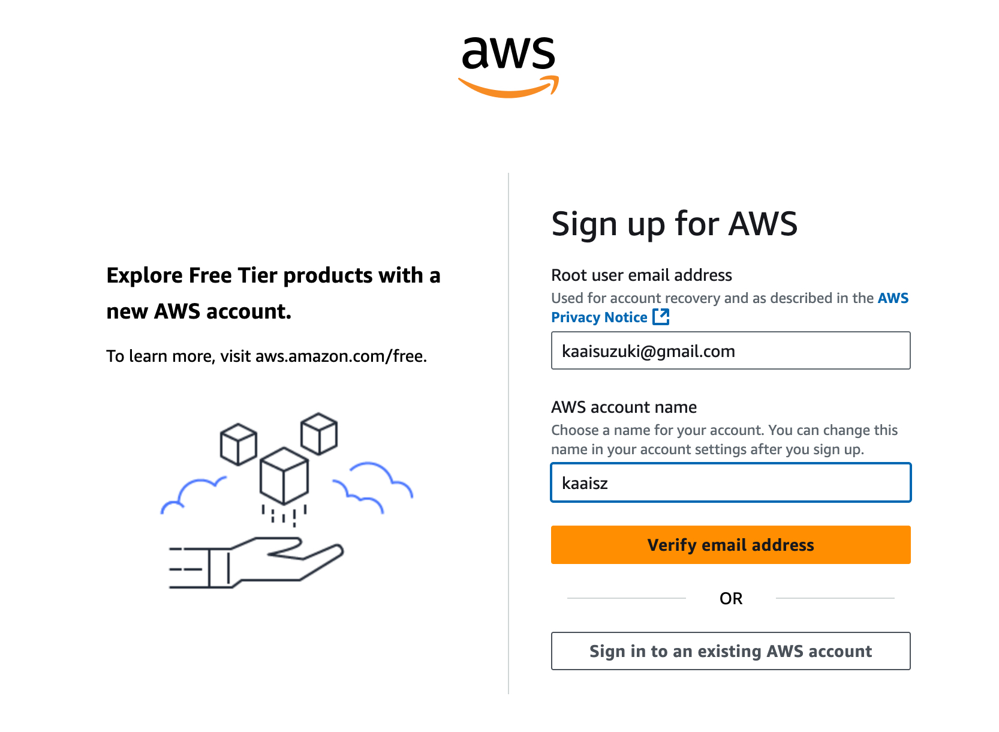
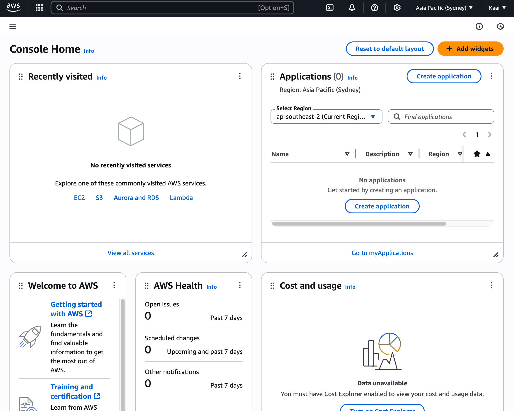

<link href="/assets/css/style.css" rel="stylesheet" />


# 自律的情報技術学習演習：作業の記録 Day-1〜中間課題

## これは何

ムサビ通信「自律的情報技術学習演習」の授業内で、Amazon EC2サーバを使用したドキュメントのアップロードを行った際の記録です

<aside>

#### 🔖 目次

- [今回よく使用したコマンド](#anchor1)
   - [サーバーログイン/ログアウト](#anchor1-1)
   - [サーバーへのアップロード(ローカルから実行)](#anchor1-2)
   - [サーバー上ファイルの削除](#anchor1-3)
   - [サーバー上ファイルの移動](#anchor1-4)
- [1. AWS アカウント登録 - root user](#anchor2)
- [2. EC2ユーザー登録](#anchor3)
- [3. ターミナル操作](#anchor4)
- [4. EC2にアップ](#anchor5)
- [5. EC2サーバにSSH接続して確認](#anchor6)
- [6. HTML化〜アップロード](#anchor7)
- [7. 画像のアップロード](#anchor8)
- [結局Notion fileをエクスポートしたものをアップした](#anchor9)
- [7/15追記 やっぱりもう一度CSSまで頑張ってみる](#anchor10)
- [7/15追記 振り返り、まとめ、気づき](#anchor11)
- [7/15追記 次のステップ](#anchor12)

</aside>

<a id="anchor1"></a>

## 今回よく使用したコマンド

ミス防止のためフルパス指定

<a id="anchor1-1"></a>

### サーバーログイン/ログアウト

```
ssh -i /path/to/key.pem ec2-user@ec2-11-22-33-44.ap-northeast-1.compute.amazonaws.com
```
<a id="anchor1-2"></a>

### サーバーへのアップロード(ローカルから実行)

```
scp -i /path/to/key.pem {file-name} ec2-user@ec2-11-22-33-44.ap-northeast-1.compute.amazonaws.com:/home/ec2-user/
```

`-r` でディレクトリのアップロード

```
scp -i /path/to/key.pem -r {directory-name} ec2-user@ec2-11-22-33-44.ap-northeast-1.compute.amazonaws.com:/home/ec2-user/
```

<a id="anchor1-3"></a>

### サーバー上ファイルの削除

```
sudo rm -rf /var/www/html/{target file or directory}
```

<a id="anchor1-4"></a>

### サーバー上ファイルの移動

```
sudo mv /home/ec2-user/{target file}(ターゲット) /var/www/html/(移動先)
```

**以下、タイトル横の▶️をクリックで内容を開閉**

<a id="anchor2"></a>

# 1. AWS アカウント登録 - root user

### 💡 Tip: GCPを選択した場合

AWSではなくGCPを選択した場合、GCPは基本的にGメールなどのGoogleアカウントがあればコンソールに入ることは可能（カードの登録などは必要）
「ようこそ」のコンソール画面が表示されれば問題ない

1. Googleからリンクにアクセス：[Amazon AWS無料利用枠](https://aws.amazon.com/jp/free/?all-free-tier.sort-by=item.additionalFields.SortRank&all-free-tier.sort-order=asc&awsf.Free%20Tier%20Types=*all&awsf.Free%20Tier%20Categories=*all) または [Amazon AWS EC2無料トライアル](https://aws.amazon.com/jp/ec2/)
2. 「無料でAWSを開始」を押下
    1. ログイン済みの場合はコンソール画面に誘導されるので、6へ
    2. 未ログインの場合は3へ
3. メールアドレスの登録
    
    
    
4. 認証を求められるので、画面に表示される文字のタイピングを行い、SMSを通して認証
5. 住所、請求情報を求められるので、それぞれ登録して完了
6. 無事に登録が済むとコンソール画面に移動
    
    
    

<aside>

### 💡 トラブルシューティング

- Q: 
登録地は日本なのに入力がアメリカから切り替えできない
- A:
    
    背景
    
    - 同時刻に多数のユーザー → AWS地域判定API負荷 →
    処理遅延 → デフォルト値（US）返却 →
    全員にアメリカが表示　という感じで起こり得るらしい (via Claude Sonnet)
    
    対応策
    
    - シークレットウインドウで新しいメールアドレスを試してみる
        - シークレットウィンドウのショートカット
        Mac: Command + Shift + N
        Win: Ctrl + Shift + N
    - ①Chromeなら「シークレットウィンドウ」でアクセスしてみる
    ②SafariやEdgeなど、別のブラウザで試す - MacだとSafariが推奨されることがある
</aside>

<a id="anchor3"></a>

# 2. EC2ユーザー登録

EC2とは、仮想のコンピュータを1分単位で借りれるサービス

1. Recently visited の画面にあるEC2をクリック(画像の一番左)
    
    
    
2. インスタンスを起動を押す
3. 名前を入力
4. Amazon Linux, インスタンスタイプ：t2microを選択
    
    ※無料枠外でメモリの容量も自分の用途に合わせて選択可能
    
5. 新しいキーペアの作成でキーペアを作成
    
    自分でクラウドサービスを作成するにあたっては、サーバーのインスタンス = 仮想サーバーの数(要素)の作成 が必要
    
    拡張子は.pem で、SSH接続のものでOK
    
6. SSHに加えて、HTTPトラフィックを許可する
    
    0.0.0.0/0 と指定がある場合、世界のどこからでも作成可能
    
7. ストレージは30gbまで無料、8GB以上推奨
8. Launch Instanceを押すと、生成される
完了するとこのパネルが表示 ↓
    
    
    
9. 上記画像グレーの塗りつぶし部分がリンクになっているので、遷移
10. パブリックIPv4アドレスをコピー
    
    
    

<aside>

### 💡 ポイント：ストレージ容量の継ぎ足しは可能だが、後からは減らせない

○ 8GBからスタートして、16GBに継ぎ足しは可能

× 16GBからスタートして、8GBへの減量は不可能

</aside>

<a id="anchor4"></a>

# 3. ターミナル操作

1. ssh接続する / 解除する

    ```
    ssh -i ~/path/to/key.pem ec2-user@YOUR_IP_ADDRESS
    ```

2. そのまま接続を試みると、このような画面が表示

    ```
    The authenticity of host '3.25.246.191 (3.25.246.191)' can't be established.
    ED25519 key fingerprint is SHA256:******************************.
    This key is not known by any other names.
    Are you sure you want to continue connecting (yes/no/[fingerprint])?
    ```

3. `yes` とタイプすると、以下のようにパーミッション権限を求められる

    ```
    Warning: Permanently added '3.25.246.191' (ED25519) to the list of known hosts.
    @@@@@@@@@@@@@@@@@@@@@@@@@@@@@@@@@@@@@@@@@@@@@@@@@@@@@@@@@@@
    @         WARNING: UNPROTECTED PRIVATE KEY FILE!          @
    @@@@@@@@@@@@@@@@@@@@@@@@@@@@@@@@@@@@@@@@@@@@@@@@@@@@@@@@@@@
    Permissions 0644 for '/path/to/key.pem' are too open.
    It is required that your private key files are NOT accessible by others.
    This private key will be ignored.
    Load key "/path/to/key.pem": bad permissions
    ec2-user@3.25.246.191: Permission denied (publickey,gssapi-keyex,gssapi-with-mic).
    ```

4. そのため、以下のコマンドでパーミッション権限を変更

    ```
    chmod 600 ~/path/to/key.pem
    ```

   1. もう一度1. のコマンドを実行。
以下のような結果が返ってくれば成功

    <aside>
    💡これがログイン成功の合図なので今後も頻繁に出てくる。以下、ログイン成功 = 🦅 として表示
    </aside>

    ```
    ,     #_
    ~\_  ####_        Amazon Linux 2023
    ~~  \_#####\
    ~~     \###|
    ~~       \#/ ___   https://aws.amazon.com/linux/amazon-linux-2023
    ~~       V~' '->
        ~~~         /
        ~~._.   _/
            _/ _/
        _/m/'
    [ec2-user@ip-000-00-0-000 ~]$
    ```

<a id="anchor5"></a>

# 4. EC2にアップ

1. 先ほどのインスタンスページを開き、再度パブリックIPV4アドレスをコピー
2. .mdファイルをSCPコマンドでアップロード
    ここでのec2-user@の部分は使用してるOSによって異なる。AWS Linuxであればec2-userで固定。
    ```
    scp -i ~/path/to/key.pem document.md ec2-user@ec2-11-22-33-44.ap-northeast-1.compute.amazonaws.com:/home/ec2-user
    ```

3. 成功すると以下のように表示

    ```
    document.md                                 100% 6942    58.2KB/s   00:00
    ```

<a id="anchor6"></a>

# 5. EC2サーバにSSH接続して確認

```
ssh -i ~/path/to/key.pem ec2-user@ec2-11-22-33-44.ap-northeast-1.compute.amazonaws.com
```

実行に成功すると、先ほど同様に鳥が表示 🦅
内容がアップされているかは、下記で確認可能

```
ls -l
cat document.md
```

ただしこのままでは公開できない

<a id="anchor7"></a>

# 6. HTML化〜アップロード

## pandocを使用する場合

1. pandocをインストール

     ```
     wget https://github.com/jgm/pandoc/releases/download/3.2/pandoc-3.2-linux-amd64.tar.gz
     ```

2. 解凍

    ```
    tar -xvzf pandoc-3.2-linux-amd64.tar.gz
    ```

3. バイナリを移動

    ```
    sudo cp -r pandoc-3.2/bin/* /usr/local/bin/
    ```

4. 動作確認

    ```
    pandoc --version
    ```

    こんな感じで出れば成功、pandocインストール完了。

    ```
    pandoc 3.2
    Features: +server +lua
    Scripting engine: Lua 5.4
    User data directory: /home/ec2-user/.local/share/pandoc
    Copyright (C) 2006-2024 John MacFarlane. Web: https://pandoc.org
    This is free software; see the source for copying conditions. There is no
    warranty, not even for merchantability or fitness for a particular purpose.
    ```

5. pandocでHTMLに変換

    ```
    pandoc -s -f markdown -t html -o document.html document.md
    ```

    ls -l した時に、document.html が作成されていれば成功

6. Apache（httpd）をインストール・起動

    ```
    sudo yum install -y httpd
    sudo systemctl start httpd
    sudo systemctl enable httpd
    ```

    正常に起動するか確認

    ```
    sudo systemctl status httpd
    ```

7. 公開ディレクトリへ

    ```
    sudo mv document.html /var/www/html/
    ```

8. 接続確認

    ```
    http://3.25.246.191/document.html
    ```

が、これでは画像のアップができていない


<a id="anchor8"></a>

# 7. 画像のアップロード

手順4-2と同じ容量で、ログインしたEC2サーバーに画像がまとまった `assets/` フォルダをアップロードしたい…**が、ここでハマる**

鍵の名前を変えたり、パーミッションを確認したりして、最終的にこの方法で通した

1. まず、鍵のファイルパスが合っているか確認
    
    ```
    ls -l /path/to/sy.pem
    ```
    
    成功していると、以下のように表示
    
    ```
    -r--------@ 1 kaaisuzuki  staff  1678 12 Jul 12:38 /path/to/an.pem
    ```
    
2. `assets` フォルダの確認
    
    ```
    ls -ld /path/to/ets
    ```
    
    成功していると、以下のように表示
    
    ```
    drwxr-xr-x@ 3 kaaisuzuki  staff  96 12 Jul 14:34 /path/to/ets
    ```
    
3. 一時的にカレントディレクトリに移動する形で、以下のコマンドを実行
    
    ```
    cd /path/to  scp -i clean.pem -r assets ec2-user@ec2-3-25-246-191.ap-southeast-2.compute.amazonaws.com:/home/ec2-user/
    ```
    
    ここで成功すると、以下のようにフォルダ中のファイルが全てアップロードされる
    
    ```
    image7.jpg                                100%  484KB 542.3KB/s   00:00
    image6.jpg                                100%  520KB   2.1MB/s   00:00
    image4.png                                100%  163KB   1.4MB/s   00:00
    image5.jpg                                100%  125KB   1.0MB/s   00:00
    image1.jpg                                100%  351KB   1.5MB/s   00:00
    image2.jpg                                100%  939KB   3.6MB/s   00:00
    image3.png                                100%   47KB 411.4KB/s   00:00
    ```
    

・・・できた！！！😭🎉


・・・しかしCSSがついていないのを忘れていた

<a id="anchor9"></a>

# 結局Notion fileをエクスポートしたものをアップした

CSSスタイリングしないといけないじゃん、と気がついて途端にめんどくさくなったので、notionで書いていた元のファイルをエクスポートしてアップすることにしました😇

### エクスポートとアップの手順(Notionユーザー限定、だいぶ簡単)

1. アプリの右上、⭐︎の横にある[…]をクリックすると「エクスポート」が出現するので、クリック
2. ダウンロードしたものを解凍
3. 名前を変更して移動
    
    タイトルは `日本語のタイトル 22o4iirhwe4flh39…` と吐き出されるので、
    名前を`index.html`や `/assets/image.png` など単純化して、アップしたいディレクトリ内に移動
    
4. Localから、フォルダをEC2にアップロード
    
    ```
    scp -i /path/to/key.pem -r {file-name} ec2-user@<EC2-IP>:/home/ec2-user/(additional path if applicable)
    ```
    
5. EC2にSSHログイン🦅して、アップロードしたファイルをApache公開ディレクトリに移動：
    
    ```
    ssh -i /path/to/key.pem ec2-user@<EC2-IP>
    sudo mv /home/ec2-user/(additional path if applicable) /var/www/html/
    ```

<a id="anchor10"></a>

# 7/15追記 やっぱりもう一度CSSまで頑張ってみる

[Qiitaの記事]()に、「CSSは1行コード当てればいいだけ」とあったので、とりあえずやってみることにした。

```
 <link rel="stylesheet" style="path/to/style.css">
```
ファイルの冒頭にこの1文を追加。
今回は時間も限られているので、GitHubに上がっている「[GitHub Markdown CSS](https://github.com/sindresorhus/github-markdown-css?tab=readme-ov-file)」をコピーして使用

目次は下記リンクを参考にし、トグルでのセクション開閉は一旦諦めた
[Markdownでページ内リンク付きの目次を作成する方法 - Qiita](https://qiita.com/miriwo/items/11b717dfc501b5b4e286)

<a id="anchor11"></a>

# 7/15追記 振り返り、まとめ、気づき

- 説明を聞き逃してしまっていたのでGitHub Pagesのmdファイルを公開していたところ、公開方法を間違っていた。
- ChatGPTのおすすめでmdファイルをコマンドラインからhtmlに変換したが、GitHubと違ってCSSがない and 画像アップが大変なことに気がついて挫折。
- しかしリトライする中で、mdファイルとHTMLが共存可能なことを初めて知ったので結果的に成功。簡単に諦めないことの重要性を感じた
EC2がいわゆるさくらのサーバーと同様Webサーバーのひとつであるということをちゃんと体で覚えることができたのは良かった
- ターミナル上でEC2を動かしてるとだんだんEC2が重くなってくる？何度かBroken pipeして終了せざるを得ない場面に見舞われた。

<a id="anchor12"></a>

# 7/15追記 次のステップ

完全プライベート型、マルチブラウザ同期可能なTwitterライクのアプリ作成。md + pdfもしくはjsonファイルエクスポート可能で、できれば画像アップにも対応させたい

Vercel + Next.js + Firebase + S3 での作成を計画中。ついでにGitHub Actionsで自動化もさせたい(できれば)